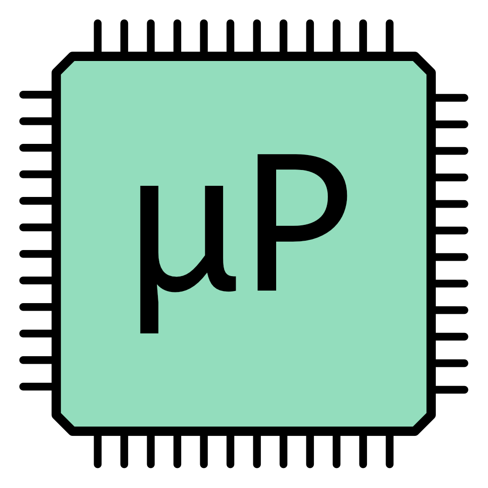

# Project Abstract

The goal of our final project is to create a self balancing two wheel robot. When pushed off balance, the robot will move forward and back to regain balance, which we define to be the upright position. We will use a PID control to control the angular velocity of the two wheels to achieve this capability. 

<!-- 

  

 -->

# Results

# Authors

Open image link in a new tab: 
 

# Project Motivation

Our motivation is experiment with control algorithms by using the IMU, our new sensor

# System Block Diagram

